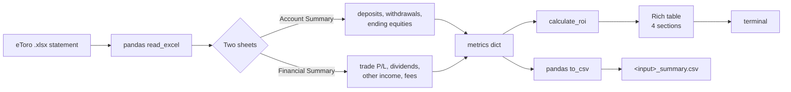
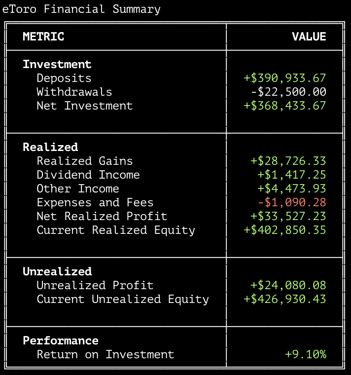

# eToro Account Statement Summariser

A single-command Python CLI that turns an eToro Excel account statement into a clean per-metric performance summary in the terminal and a CSV alongside the input file.

[](https://github.com/weirdapps/etoro_statement/actions/workflows/ci.yml)
[](https://github.com/weirdapps/etoro_statement/actions/workflows/codeql.yml)
[](https://github.com/weirdapps/etoro_statement/actions/workflows/sonarcloud.yml)
[](https://github.com/weirdapps/etoro_statement/actions/workflows/deps-refresh.yml)
[](LICENSE)
[](https://www.python.org/downloads/)

## What it is

`etoro_statement` is a small, focused command-line utility for retail eToro users. eToro's exported account statement is a multi-sheet Excel workbook. This tool ignores the noise and pulls only the aggregates that matter (deposits, withdrawals, realised gains, dividends, fees, equity), then prints a coloured, sectioned Rich table and writes the same numbers to a `_summary.csv` next to the source file for further analysis.

It does one thing, in one script (`etoro_summary.py`, about 300 lines), with no configuration and no persistent state.

## Pipeline


```mermaid
flowchart LR
    A[eToro .xlsx statement] --> B[pandas read_excel]
    B --> C{Two sheets}
    C -->|Account Summary| D[deposits, withdrawals,<br/>ending equities]
    C -->|Financial Summary| E[trade P/L, dividends,<br/>other income, fees]
    D --> F[metrics dict]
    E --> F
    F --> G[calculate_roi]
    G --> H[Rich table<br/>4 sections]
    F --> I[pandas to_csv]
    H --> J[terminal]
    I --> K[&lt;input&gt;_summary.csv]
```

## Features

Grounded in `etoro_summary.py`:

- Reads the `Account Summary` and `Financial Summary` sheets from an eToro-exported `.xlsx`.
- Extracts 11 metrics: total deposits, total withdrawals, net investment, realised gains, dividend income, other income, total expenses and fees, net realised profit, current realised equity, current unrealised equity, unrealised profit.
- Computes Return on Investment as `net_realized_profit / abs(net_investment)` (percentage, with sign).
- Robust to eToro's shifting column names: tries four variants of the amount column (`"Amount\r\n in (USD)"`, `"Amount in (USD)"`, `"Amount\nin (USD)"`, `"Amount (USD)"`) and falls back to any column containing both `Amount` and `USD`.
- Terminal output uses `rich` with four sections (Investment, Realized, Unrealized, Performance); positive values render green, negative red.
- Persists the same metrics to a CSV named `<input>_summary.csv` in the same directory as the source workbook.
- Exits with a clear error on missing input or unloadable file.

## Example output



A minimal CSV counterpart is committed as `etoro-account-statement-1-1-2023-2-21-2026_summary.csv` next to the sample workbook.

## Requirements

- Python 3.11 or newer (CI runs on 3.12).
- [`uv`](https://docs.astral.sh/uv/) for dependency management.

Runtime dependencies (pinned in `uv.lock`):

- `pandas` (3.x)
- `openpyxl` (3.1+)
- `rich` (15.x)
- `tabulate` (0.10+)

## Installation

```bash
git clone https://github.com/weirdapps/etoro_statement.git
cd etoro_statement
uv sync --frozen
```

`uv sync --frozen` installs the exact versions in `uv.lock`. Drop `--frozen` if you want `uv` to re-resolve.

## Usage

Point the script at any eToro-exported `.xlsx` account statement:

```bash
uv run python etoro_summary.py path/to/etoro-account-statement.xlsx
```

The tool will:

1. Load the `Account Summary` and `Financial Summary` sheets.
2. Print a Rich-formatted summary table to the terminal.
3. Write `path/to/etoro-account-statement_summary.csv` next to the input.

A real anonymised eToro statement covering 2023 to Feb 2026 is committed as `etoro-account-statement-1-1-2023-2-21-2026.xlsx`, so you can try the tool without exporting your own:

```bash
uv run python etoro_summary.py etoro-account-statement-1-1-2023-2-21-2026.xlsx
```

## How eToro's data maps to the output sections

| Section | Metrics | Source in the workbook |
|---|---|---|
| Investment | Deposits, Withdrawals, Net Investment | `Account Summary` rows `Deposits`, `Withdrawals` |
| Realized | Realized Gains, Dividend Income, Other Income, Expenses and Fees, Net Realized Profit, Current Realized Equity | `Financial Summary` (rows with `Profit or Loss`, `Dividend`, `fee`, `charge`, plus `Account Summary` row `Ending Realized Equity`) |
| Unrealized | Unrealized Profit, Current Unrealized Equity | `Account Summary` row `Ending Unrealized Equity`, minus realised equity |
| Performance | Return on Investment | Computed: `net_realized_profit / abs(net_investment)` |

Categorisation of `Financial Summary` rows follows the rules in `process_etoro_statement`:

- Any row whose `Name` contains `Profit or Loss` with a positive amount is added to Realized Gains.
- Any row whose `Name` contains `Dividend` is added to Dividend Income.
- Any row whose `Name` contains `fee` or `charge`, or any other negative amount not already categorised, is added to Total Expenses and Fees (stored as a positive number, subtracted from profit at the end).
- Any remaining positive amount is added to Other Income.

## Development

Install dev tools and run the checks:

```bash
uv sync --frozen
uv run ruff check .
uv run ruff format --check .
uv run pytest
```

The test suite (`tests/test_etoro_summary.py`) covers ROI edge cases (positive, negative, zero investment, zero profit), the shape of the metrics dictionary, table construction on synthetic data, and the missing-file error path.

## Continuous Integration

All workflows run against the `master` branch.

| Workflow | File | Trigger |
|---|---|---|
| CI (ruff + pytest) | [`ci.yml`](.github/workflows/ci.yml) | push and PR to `master` |
| CodeQL | [`codeql.yml`](.github/workflows/codeql.yml) | push, PR, weekly (Mon 06:00 UTC) |
| SonarCloud | [`sonarcloud.yml`](.github/workflows/sonarcloud.yml) | push, PR, manual (skipped if `SONAR_TOKEN` unset) |
| Monthly Dependency Refresh | [`deps-refresh.yml`](.github/workflows/deps-refresh.yml) | 6th of each month, 04:23 UTC (opens PR with a fresh `uv.lock`) |
| Dependabot auto-merge | [`dependabot-auto-merge.yml`](.github/workflows/dependabot-auto-merge.yml) | Dependabot PRs (patch and minor auto-merge; major stays manual) |

## Project layout

```text
etoro_statement/
├── etoro_summary.py                                       # entire application
├── tests/
│   └── test_etoro_summary.py                              # ~15 tests across 5 classes
├── etoro-account-statement-1-1-2023-2-21-2026.xlsx        # sample eToro workbook
├── etoro-account-statement-1-1-2023-2-21-2026_summary.csv # sample summary output
├── example_output.png                                     # screenshot of the Rich table
├── pyproject.toml                                         # deps + ruff/mypy/pytest config
├── uv.lock                                                # pinned dependency graph
└── .github/workflows/                                     # CI, CodeQL, SonarCloud, deps refresh
```

## Security

Report vulnerabilities per [`SECURITY.md`](SECURITY.md). Do not open a public issue for security reports.

## License

[MIT](LICENSE). Copyright (c) 2026 Dimitris Plessas.
