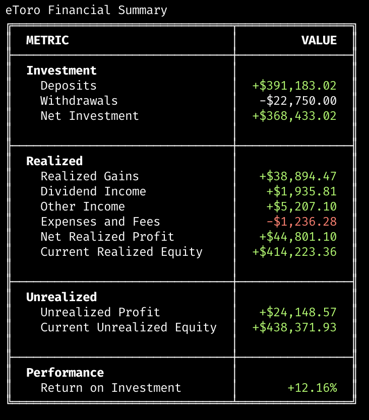

# eToro Account Statement Processor

A Python tool that processes eToro account statements and generates comprehensive financial summaries.

## Overview

This tool extracts essential financial metrics from eToro Excel-based account statements and provides a clean, organized summary focusing on:

- Investment summary (deposits, withdrawals, net investment)
- Realized performance (gains, dividends, income, expenses, profits)
- Unrealized performance (unrealized profit, current equity)
- Performance metrics (Return on Investment)

The tool automatically saves all extracted metrics to a CSV file for further analysis.

## Requirements

- Python 3.6+
- pandas
- openpyxl
- rich
- tabulate

Install the required packages with:

```bash
pip install pandas openpyxl rich tabulate
```

## Usage

```bash
python etoro_summary.py path_to_statement.xlsx
```

### Example

```bash
python etoro_summary.py etoro-account-statement-1-1-2023-5-15-2025.xlsx
```

This will:
1. Process the eToro statement file
2. Display a comprehensive financial summary in the terminal
3. Generate a CSV file with the complete metrics (saved in the same directory as the input file)

## Output Example

The tool generates a clean, minimal formatted table with sections:



ROI is calculated and displayed as a percentage based on Net Realized Profit divided by the absolute value of Net Investment.

